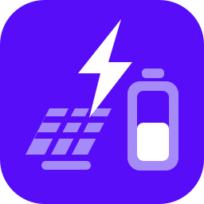

  

<h1 align="center">Home Battery Simulator</h1>

A locally-run web app that retrospectively simulates what a home battery would have saved a
Dutch household, using that household's own historical data under the post-2027 Dutch regime in
which net metering (*salderen*) no longer exists. It answers "what if I had owned this battery,
over this period" — it is not a forecaster and not a controller.

## Using the app

- **[Installing and running](docs/en/install.md)** — [Installeren en starten](docs/nl/installatie.md)
- **[The security warnings your OS shows](docs/en/security-warnings.md)** — [Beveiligingswaarschuwingen](docs/nl/beveiligingswaarschuwingen.md)
- **[Supporting the project](docs/en/sponsor.md)** — [Het project steunen](docs/nl/sponsor.md)

Every page exists in English and Dutch; the index is [`docs/README.md`](docs/README.md).

The short version: builds are published on the
[releases page](https://github.com/knz/battery-sim/releases) for **Linux** (an AppImage),
**macOS** (Apple silicon and Intel) and **Windows**. None of them is signed, so macOS and
Windows [show a warning on first open](docs/en/security-warnings.md).

Some features are specified but not yet built; the app marks those controls *pending* and
explains what is missing. The current state is tracked in
[docs/specs/implementation-progress.md](docs/specs/implementation-progress.md).

## Licence

**GNU Affero General Public License v3.0 only** (`AGPL-3.0-only`). The full text is in
[LICENSE](LICENSE).

The AGPL's distinguishing clause is §13: if you run a modified version and let other people use
it over a network, those users are entitled to the source of your modified version. Running the
app on your own machine for yourself — which is what it is designed for — triggers nothing.

## Supporting the project

The desktop builds are unsigned, which is why macOS and Windows warn about them. What signing
would cost and what it would actually fix is set out in
[docs/en/sponsor.md](docs/en/sponsor.md) ([Nederlands](docs/nl/sponsor.md)).

## Working on the app

Running from source, the stack and repository layout, rebuilding the stylesheet, the test
suite, and updating translations are documented in
**[docs/maintainers/](docs/maintainers/README.md)**.

The full specification lives in [`docs/specs/README.md`](docs/specs/README.md).
